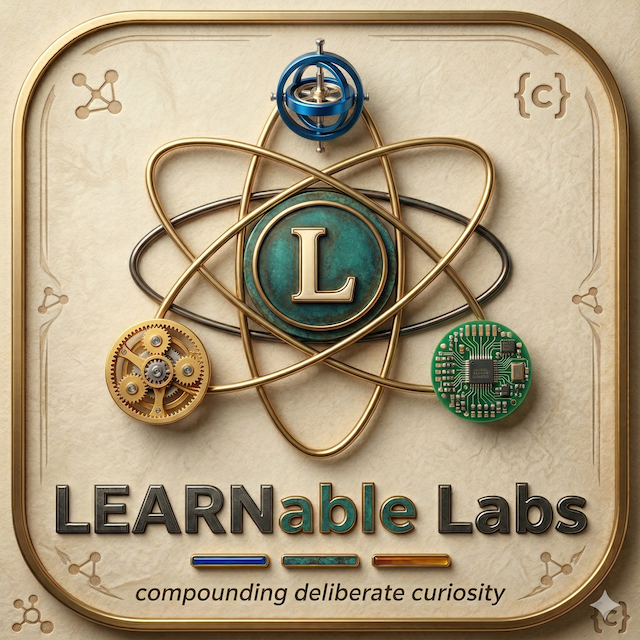

<p align="center">
  
</p>

# LEARNable Labs

Landing page for [LEARNable Labs](https://github.com/LEARNableLabs) — an ed-tech venture building **OpenTutor**, an open-source AI learning companion.

**Mission:** Educate one billion scientists and engineers at 1% of the cost of today's best education.

**Website:** [learnablelabs.github.io/learnable-labs](https://learnablelabs.github.io/learnable-labs/)

## Quick Start

No build step, no dependencies. Open `index.html` in a browser.

```bash
# or serve locally
python3 -m http.server 8000
open http://localhost:8000
```

## What's Here

A single-page site with:

- **3D shape visualizations** — torus, sphere, Lorenz attractor, cellular automata, and more, rendered on 2D canvas via parametric equations and perspective projection
- **Scroll-triggered animations** — reveal effects with configurable duration, easing, blur, and stagger
- **Background particle system** — floating dots with connecting lines
- **Interactive controls panel** — tweak every visual parameter live (shape, points, glow, CA rules, scroll timing, particles)
- **Presets** — FRL Original, Minimal, Dramatic, Snappy, Dreamy
- **Prompt bar** — generates a natural-language description of the current config

## Project Structure

```
index.html   — page structure (nav, hero, content sections, controls, prompt bar)
index.css    — styling with CSS custom properties, dark panel, warm academic aesthetic
index.js     — all logic in a single IIFE (shape renderer, CA simulator, particles, scroll reveal, UI)
docs/          — technical design docs and project notes
```

## Tech Stack

- Vanilla HTML / CSS / JS — no frameworks, no build tools
- [EB Garamond](https://fonts.google.com/specimen/EB+Garamond) via Google Fonts
- CSS custom properties for theming

## License

See repository for license details.
