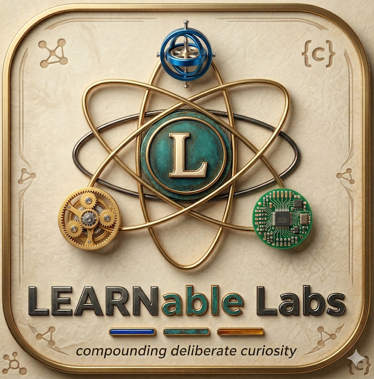

<p align="center">
  
</p>

# LEARNable Labs

Landing page for [LEARNable Labs](https://github.com/LEARNableLabs) — an ed-tech venture building **OpenTutor**, an open-source AI learning companion.

**Mission:** Educate one billion scientists and engineers at 1% of the cost of today's best education.

**Website:** [learnablelabs.github.io/learnable-labs](https://learnablelabs.github.io/learnable-labs/)

## Quick Start

No build step, no dependencies. Open `index.html` in a browser.

```bash
# or serve locally
python3 -m http.server 8000
open http://localhost:8000
```

A single-page site built with vanilla HTML/CSS/JS — no frameworks, no build tools. See [`docs/`](docs/) for technical design details.
